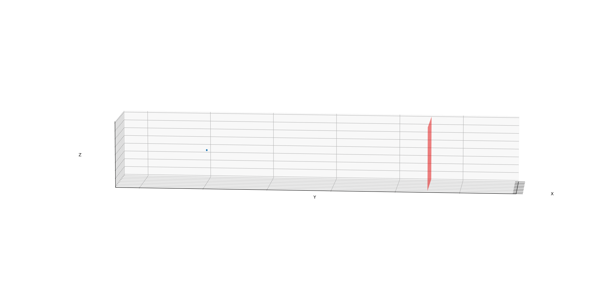

# tpl_SEVI
2021 Physics Data Course Atomic and Molecular Physics Homework -- Slow Electron Velocity Imaging

## 物理背景
精细测量原子分子与离子的电子能级与电离能是一项重要且具有难度的任务。一种常见的做法是，使用激光激发位于某一能级的体系，使之释放电子。已知激光光子的能量为 $E = h\nu$，通过精确测量电子的动能 $E_k$ 来得知体系的束缚能（Binding Energy）$E_B = E - E_k$，这样的方法成为光电子能谱法（PES，Photonelectron/Photoemission Spectroscopy）。PES 在实验凝聚态与原子分子物理中有着广泛的应用。

冷原子/分子/离子团簇，经过瞬时激光照射后，会向各个方向发射大量电子。精确测量电子的动能就可以知道该能级的电离能 $E_B$。对于某一固定的电离能与激光波长，电子出射的动能固定，其动量空间是约束在一球面上：$p_x^2 + y_y^2 + p_z^2 = 2 m E_k$。所谓 SEVI，就是指对电子动量相空间进行“成像”，找到这个球面，进而测得 $E_k$。实际上，由于体系可能存在多个束缚能，因此 $E_k$ 往往是多个分立的值，动量空间为多个球面。

如何将动量空间转化为可测量的实空间？由于电子速度较慢，且可以认为发射电子的冷原子/离子体系速度近似为0，因此，可以让电子从团簇中自由扩散。以电子电离为时间 0 点，假设电子之间没有相互作用，则在 $t$ 时刻，电子位置为 $\vec{r}=\vec{v}t$，电子将扩散成半径 $r=vt$ 的球面，且电子相对与球心的角分布正是电子动量的角分布。因此，如同烟花，通过让电子匀速扩散，即可将速度场 $\vec{v}$ 转化为电子的空间位置场 $\vec{r}$。

*图1. $\vec{r}=\vec{v}t$，蓝色点为被电离的光电子*

为了测量 $\vec{r}$，实验学家制作了一段真空漂移管，通过电场能够让电离出来的电子在 $y$
方向整体获得一个速度，进而让电子团以一定速度漂移来固定时间 $t$，如图2。不过，由于探测器为一个屏幕，因此，又精心调整了电场，使得电子漂移时在 $xOz$ 平面上保持相对位置不变，而最终整个球面的电子会几乎同时击打至平面探测器上。这很好得保证了飞行时间 $t$ 对于每个电子都是一致的，如图3。

*图2. 实验室坐标系，红色平面为单电子探测器*

*图3. 使用电场对电子进行成像，使其 $y$ 方向聚焦至探测器*

最终的图像为，原子团簇向四周发射电子；受成像电场作用，电子集体向 y 方向运动，经过时间 $t$ 的漂移后抵达探测平面；同时在 xOz 平面电子相对于质心系匀速膨胀。

*图4. 完整的仪器。我们关注从激光脱附（电离）到成像阶段*
# 第一阶段大作业
抵达探测平面后，电子较为稀疏。微通道板会将每个电子放大为大量电子，最终轰击荧光屏形成亮斑。亮斑由 CCD 相机拍照记录。

实验者试图获得的 $\vec{v}$ 是一个分布，统计量越高效果越好，但每一次激光照射只能激发为数不多的电子，因此，在实际中，各个电子的真实速度是对 $\vec{v}$ 的随机采样，荧光屏上的斑点也数目有限，一次实验要采集 50000 张照片，才可以获得较好的成像。

另外，由于激光被调制为 $z$ 轴的线偏振光，因此 $\vec{v}$ 关于 z 轴对称，空间可由柱坐标 $(r,z)$ 表示（关于 $\theta$ 对称）。简单起见，我们认为漂移时间 $t=1$，即 $\vec{v} = $\vec{r}。

你的任务是：模拟电子从离子团簇出射至探测器读出信号的过程。
输入：电子速度分布 $\vec{v}$。
输出：对于每一个分布，进行 50000 次实验。每次实验首先输出电子速度分布 $\vec{v}$ 的采样，然后生成 1 张CCD 相机输出的照片，像素是 2048x2048。

你需要对以下几种分布进行 $\vec{r}$ 的随机采样：
 1. 球坐标下，$\theta$ ~ $U(0,\pi)$，$\phi$ ~ $U(0,2\pi)$，$|\vec{r}|=R_0，光电子数目固定，NPE=100
 2. 球坐标下，$\theta$ ~ $U(0,\pi)$，$\phi$ ~ $U(0,2\pi)$，$|\vec{r}|$ ~ $U(R_0,R_0 +\Delta R)$ 光电子数目服从高斯分布：NPE ~ $N(100,10)$，但 NPE 一定为整数且 NPE > 0
 3. 柱坐标下，$z$ ~ $U(0,R_0)$，$\phi$ ~ $U(0,2\pi)$，$|\vec{r}|$ ~ $U(R_0,R_0 +\Delta R)$，光电子数目服从泊松分布：NPE ~ $\pi(100)$。
 4. 球坐标下，$\cos^3\theta$ ~ $U(-1,1)$，$\phi$ ~ $U(0,2\pi)$，$|\vec{r}|$ ~ $U(R_0,R_0 +\Delta R)$，光电子数目服从泊松分布：NPE ~ $\pi(100)$。

## 数据格式

你需要自己定义一个数据格式，满足如下要求：

 1. 针对每一个分布，输出一个 hdf5 文件，文件名为 VelocityImage_%d.h5
 2. 在 hdf5 文件中，你需要包含若干表格（若干是指，不多于 10 个），能够完备描述任务要求的输出信息。
 3. 所谓完备信息是指这些：每次实验产生的光电子数目是多少，每次实验电离出的光电子的速度矢量（用与其等效的 $\vec{r}$ 表示），以及每次实验 CCD 拍摄的图片（不同难度等级有不同定义，见下文）。
 4. 尽量少存储冗余信息。

你需要写一个小程序 read_sim_data.py （也可以使用其它语言），读取自己的 hdf5 数据，接受实验编号作为命令行参数，输出一张名为 `<实验编号>.png` 的图片，并打印本次实验所产生的光电子数。你需要为图片加上必要的文字（如 title，坐标轴等），并在命令行输出一些必要的提示信息，让运行程序的助教看得懂图片是什么意思，看得懂命令行输出的东西是什么意思。
## 基础内容 60'
你无需考虑任何复杂的物理过程与实验中的细节。你可以将微通道板与 CCD 组成的探测平面视作像素化的计数器，每一个像素能统计落入该像素的电子数目。

在此难度级别下，CCD 图像的定义是，每个像素点上接收到的电子数目。

正确完成基础内容，可以获得 60% 的分数。

## 提高内容
你需要考虑一些实验细节或者较为复杂的物理过程。例如：

### 激光方向偏角与倾斜的探测平面

激光偏振方向不再完美指向 $+z$，而是指向 $(\theta_l,\phi_l)$，$\theta_l\ll 1$

探测法方向不再完美指向 $-y$，而是指向 $(\frac{\pi}{2} + \theta_d,\phi_d - \frac{\pi}{2})$，$|\theta_d|, |\phi_d| \ll 1$

考虑这两个问题将分别为你加 5% 的分数。

### 亮斑的形状

你需要考虑更真实的拍摄过程。

#### level 1:
无论如何，电子最终导致荧光屏上产生一个高斯圆形亮斑：设电子击中的位置位于荧光屏的 $(x_0,y_0)$，则电子将在屏幕上产生 $I_0(x,y)=I(x-x_0,y-y_0)=\frac{A}{\sqrt{2\pi\sigma}}\exp [-\frac{1}{2}\frac{(x-x_0)^2+(y-y_0)^2}{\sigma^2}]$ 的荧光光强，其中 $A=100$，$\sigma=0.001$。当两个光子的光斑有所重叠时，$I_{1,2}(x,y)$ 线性叠加：$I_{1,2}(x,y)=I_1(x,y)+I_2(x,y)=I(x-x_1,y-y_1)+I(x-x_2,y-y_2)$。

由于最后 CCD 相机的输出也要保存为像素化的数据，你需要对连续的像 $I(x,y)$ 进行离散化处理。CCD 视野内的荧光屏是一个 $[-1,1] \otimes [-1,1]$ 的矩形，CCD 像素 2048x2048，每个像素最终输出的强度大小是该像素内荧光光强 $I$ 的均值。

你还需要考虑 CCD 的白噪声：每个像素上会产生高斯噪声，分布为 $N(0,2)$。

CCD 的输出是一个整数；CCD 的饱和强度为 255，意味着超过 255 的输出都会被归结为 255；最低输出是 0，任何低于 0 的数值会被归 0。

除此之外，你需要考虑到电子不被探测到的可能性：对于单个电子，有 10% 的概率根本不会被探测到。你需要把电子是否被探测到这一部分中间信息加入你的数据结构，并且在 read_sim_data.py 打印有多少光电子被探测到了。

完成该部分将获得 5% 的分数。

#### level 2:

level 2 与 level 1 不兼容——你不能同时完成他们。level 2 是 level 1 的升级版。如果你都完成了他们，评分时默认你完成了这一部分，不过如果你的代码历史展现出了循序渐进，从易到难的研发过程，我们会在较为主观的版本控制部分（比如评价 commit message 书写等）为你加分。

请先阅读 level 1 的说明，以便更好理解 level 2 的描述。

现在，亮斑不再是一个圆形高斯斑点，强度与宽度也不再固定。$I_0(x,y)=I(x-x_0,y-y_0)=\frac{A}{\sqrt{2\pi\sigma}}\exp [-\frac{1}{2}\frac{(x-x_0)^2+(y-y_0)^2+2\rho (x-x_0)(y-y_0)}{\sigma^2}]$，$A$，$\sigma$, $\rho$ 都是满足（可能带截断的）高斯分布的随机变量：$A$ ~ $N(100,10)$ 且 $A>0$；$\sigma$ ~ $N(1e-3,1e-4)$ 且 $\sigma$ > 0; $\rho$ ~ $N(0,1)$。

与 level 1 类似，你也需要考虑白噪声，以及光电子不被探测的概率并在数据文件中标记；此外，针对**被探测**到的电子，你需要记录他们产生光斑的 $A$，$\sigma$, $\rho$，且在 read_sim_data.py 输出光电子个数、被探测到光电子个数之后打印被探测到电子的这三个变量。

#### level 3:

## 开放问题
你需要考虑一些尚未得到解决或考察的前沿问题。例如：

### 电子-电子相互作用建模

### 微通道板对于电子放大过程的建模

## 其它
你需要遵守基本礼仪，例如遵守学术规范、按要求使用版本控制。如果你使用了第三方的软件，特别是非自由软件，请务必熟悉其条款。如果第三方代码规定未经授权不得使用，那么使用时请取得授权。

## 第二阶段大作业

To be continued ...
