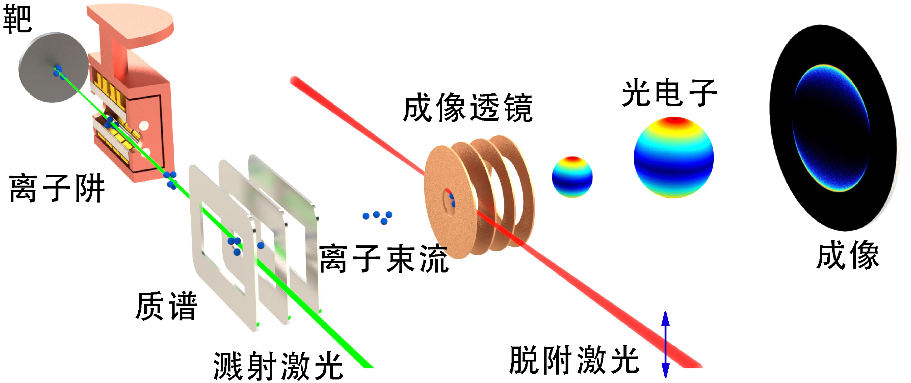
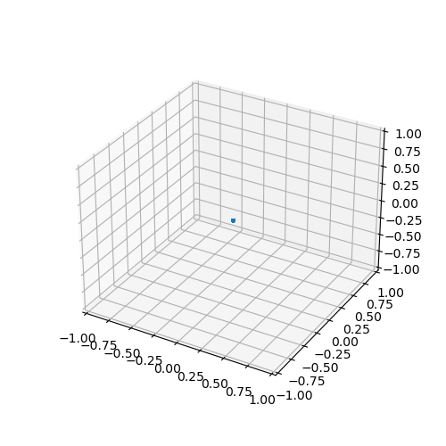
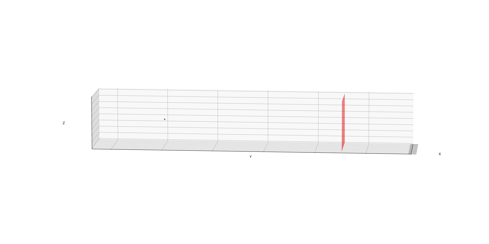
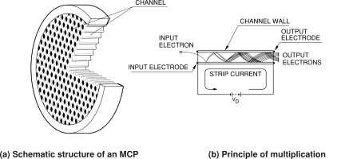
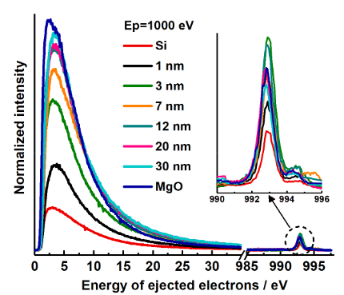
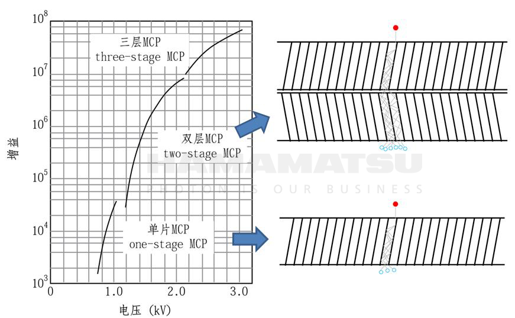
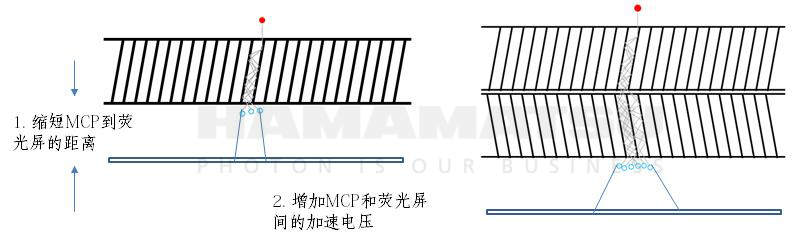

# Slow Electron Velocity Imaging
2022 Physics Data Course: Atomic and Molecular Physics Homework

提示：本题中有一些 GIF 动画无法嵌入 PDF，可以在网页或者仓库中查看。

## 物理背景
### SEVI
精细测量原子分子与离子的电子能级与电离能是一项重要且具有难度的任务。一种常见的做法是，使用激光激发位于某一能级的体系，使之释放电子。已知激光光子的能量为 $E = h\nu$，通过精确测量电子的动能 $E_k$ 来得知体系的束缚能（Binding Energy）$E_B = E - E_k$，这样的方法成为光电子能谱法（PES，Photonelectron/Photoemission Spectroscopy）。PES 在实验凝聚态与原子分子物理中有着广泛的应用。

*图1. 完整的仪器。我们关注从激光脱附（电离）到成像阶段*

激光打在靶上，产生的负离子(离子阱可以对负离子降温)经过质谱仪筛选出目标离子团簇，加速并聚焦至成像透镜。脱附激光在成像透镜的前两个电极间的区域和离子团簇作用，产生因激光脱附的电子。之后加速并击中MCP并在CCD上成像[1,2]。

冷原子/分子/离子团簇，经过瞬时激光照射后，会向各个方向发射大量电子。精确测量电子的动能就可以知道该能级的电离能 $E_B$。对于某一固定的电离能与激光波长，电子出射的动能固定，其动量空间是约束在一球面上：$p_x^2 + y_y^2 + p_z^2 = 2 m E_k$。所谓 SEVI，就是指对电子动量相空间进行“成像”，找到这个球面，进而测得 $E_k$。实际上，由于体系可能存在多个束缚能，因此 $E_k$ 往往是多个分立的值，动量空间为多个球面。

如何将动量空间转化为可测量的实空间？可以让电子从团簇中自由扩散。以电子电离为时间 0 点，假设电子之间没有相互作用，则在 $t$ 时刻，电子位置为 $\vec{r}=\vec{v}t$，电子将扩散成半径 $r=vt$ 的球面，且电子相对与球心的角分布正是电子动量的角分布。因此，如同烟花，通过让电子匀速扩散，即可将速度场 $\vec{v}$ 转化为电子的空间位置场 $\vec{r}$。

*图2. $\vec{r}=\vec{v}t$，蓝色点为被电离的光电子*

为了测量 $\vec{r}$，实验学家制作了一段真空漂移管，通过电场能够让电离出来的电子在 $y$
方向整体获得一个速度，进而让电子团以一定速度漂移来固定时间 $t$，如图2。

*图3. 实验室坐标系，红色平面为单电子探测器*

最终的图像为，原子团簇向四周发射电子；受成像电场作用，电子集体向 y 方向运动，经过时间 $t$ 的漂移后抵达探测平面；同时电子相对于质心系匀速膨胀，形成一个球面。

### MCP

*图4:微通道板结构*

微通道板(MCP)是很多中空的通道排列在二维平面上组成的薄片结构，如图4a所示。MCP的表面和通道璧镀上了容易激发出二次电子的材料(如Al2O3)，电子(动能为$E_k$)入射到通道内部后会激发出N个二次电子，N受入射电子能量和镀膜厚度影响。实验结果显示膜厚越大，N越大；随入射电子动能增加，N先增加后减少。激发的二次电子在通道内部的电场作用下加速，再次轰击管壁，产生更多的二次电子，最终在出口输出倍增的大量电子，如图4b所示。MCP两端电压越高，厚度越大，增益(电子倍增因子)越大。

*图4:二次电子的动能*

二次电子的动能主要分布在0和$E_k$附近，如图5所示。$E_k$附近的二次电子主要是入射电子弹性散射产生，0附近的二次电子主要为电离产生。有一些模型描述了二次电子的发射过程，但是包含有很多需要实验测量的参数[4]。

*图5:MCP的增益[3]*

通常单片MCP的增益控制在$10^3-10^4$，如果获得更高的增益，需要将多片MCP串联起来，如图5. 但是当串联更多或者单片MCP增益过高的时候，最后一片MCP每个通道进入的电子数过多，导致无法达到正常预期的增益，这种现象说明MCP已经饱和。本作业假定MCP均工作在线性状态。

*图6:单层MCP和两层MCP与荧光屏[3]*

倍增的电子会在电场作用下轰击荧光屏，电子数目较多时，相互作用导致分辨率下降。

# 基础任务(Elementary Task) 85'
抵达探测平面后，电子较为稀疏。微通道板（Microchannel Plate, MCP）会将每个电子放大为大量电子，最终轰击荧光屏形成亮斑。亮斑由 CCD 相机拍照记录。

实验者试图获得的 $\vec{v}$ 是一个分布，统计量越高效果越好，但每一次激光照射只能激发为数不多的电子，因此，在实际中，各个电子的真实速度是对 $\vec{v}$ 的随机采样，荧光屏上的斑点也数目有限，一次实验要采集 50000 张照片，才可以获得较好的成像。

另外，由于激光被调制为 $z$ 轴的线偏振光，因此 $\vec{v}$ 关于 z 轴对称，空间可由柱坐标 $(r,z)$ 表示（关于 $\theta$ 对称）。简单起见，我们认为漂移时间 $t=1$，即 $\vec{v} = \vec{r}$。

你的任务是：模拟电子从离子团簇出射至探测器读出信号的过程。
输入：电子速度分布 $\vec{v}$。
输出：对于该分布，进行 50000 次实验。每次实验首先输出电子速度分布 $\vec{v}$ 的采样，然后生成 CCD 相机输出的照片，像素是 $2048 \times 2048$。

## ET-1: 电子漂移 10'

对电子位置和速度分布进行随机采样，将所有电子视作几乎同时入射到平面上，分布简化为：
+ 质心系球坐标下，位置球对称分布在一个窄的球壳上，$\cos^3\theta$ ~ $U(-1,1)$，$\phi$ ~ $U(0,2\pi)$，$|\vec{r}|$ ~ $U(R_0,R_0 +\Delta R)$，光电子数目服从泊松分布：NPE ~ $\pi(100)$。
+ 与质心系同速的电子动能为300eV，质心系下电子的动能很小为**1meV**.作业中计算电子动能时忽略质心系下的速度。

 其中，$R_0$[ = 0.8](https://github.com/physics-data/faq/discussions/81)，相当于最终探测平面尺度的 80%。 $\Delta R$ = 0.02.（以上均为归一化尺寸，归一化尺寸因子为CCD的大小0.01m$\times$0.01m）

1. 编写一个程序 `sevi_simulate.py` 来完成模拟，其接受一个参数：输出的 HDF5 文件名。输出内容为每个电子落在MCP表面的位置以及速度大小和方向信息。编写完成后，运行 `make` 可以生成 `VelocityImage.h5`。
2. 编写一个程序 `read_sim_data.py` ，接受 HDF5 文件名、输出文件名作为命令行参数，绘制所有电子位置的直方图。你需要为图片加上必要的文字（如 title，坐标轴等），并在输出一些必要的提示信息，让运行程序的助教看得懂图片是什么意思、看得懂命令行输出的东西是什么意思。此部分无需对所有实验全部运行，助教将会挑选进行抽查。

> 仓库中提供了两个DEMO(不保证完全符合题目)，其中包含存储，读取HDF5和保存图片至pdf中的示例。如果需要的话，你可以参考并填充其中的必要部分。当然你可以自己重新实现一份代码，图片存储格式不限于pdf，你可以自由选择。

注意：考虑到体积因素，**不允许**将生成的任何数据文件提交到仓库中。如果你认为程序运行时间可能较长，可以在报告中提供预先生成的结果文件的下载方式（如清华云盘地址）。也建议你将一些有代表性的结果图插入到实验报告中，以便助教批阅。

## ET-2 MCP倍增 50'
+ MCP表面和通道的面积比为表面积:孔面积=**4:6**。入射在MCP表面的电子在`ET-2`中认为损失掉了，你可以按照0.6的Bernoulli分布描述。
+ 在`ET-2`中认为产生的二次电子数目 N 服从泊松分布$\pi(4)$。每个电子的能量为入射电子动能的平均$\frac{E_k}{N}$。二次电子到下次碰撞管壁之前在电场作用下能量增加20eV。
+ 二次电子的倍增次数：在`ET-2`中认为倍增次数 G 服从泊松分布$\pi(10)$

从上面的过程中可以得到一个电子倍增后的电子动能分布，此外在`ET-2`中认为出射的二次电子角度分布为$U(0.004,1)$。电子的动能分布可以按照你的思考存储起来以便后续使用。

从第一层 MCP 出射后，大量电子会在两层 MCP 之间的间隙飞行，间隙距离为 $d_1=10^{-5}$，匀速飞行后电子入射第二层 MCP。在第二层中的倍增过程和上述类似，

1. `single_mcp.py`: 模拟单层MCP倍增电子过程，并存储100次模拟的结果，包括出射的电子动能。
2. `dual_mcp.py`: 根据单层MCP的模拟结果计算双层mcp的倍增结果，包括出射电子的动能和出射位置(你可以将两个过程合并，但是需要考虑计算量)。
3. `read_single_mcp.py`: 绘制单层mcp出射的电子动能分布图。
4. `read_dual_mcp.py`: 绘制双层mcp出射的电子位置和电子动能分布图。

## ET-3 CCD上的图像 25'
从第二层 MCP 出射后，距离荧光屏 $d_2=10^{-3}$，匀速飞行后撞击荧光屏并发光。

无论如何，电子最终导致荧光屏上产生一个高斯圆形亮斑：设电子击中的位置位于荧光屏的 $(x_0,y_0)$，则电子将在屏幕上产生 $I_0(x,y)=I(x-x_0,y-y_0)=A\exp [-\frac{1}{2}\frac{(x-x_0)^2+(y-y_0)^2}{\sigma^2}]$ 的荧光光强，其中 $A=100$，$\sigma=0.001$。当两个光子的光斑有所重叠时，$I_{1,2}(x,y)$ 线性叠加：$I_{1,2}(x,y)=I_1(x,y)+I_2(x,y)=I(x-x_1,y-y_1)+I(x-x_2,y-y_2)$。

最终 CCD 每个像素的亮度值，是落入该像素内的电子数目除以 50 并四舍五入取整。

由于最后 CCD 相机的输出也要保存为像素化的数据，你需要对连续的像 $I(x,y)$ 进行离散化处理。CCD 视野内的荧光屏是一个 $[-1,1] \otimes [-1,1]$ 的矩形，CCD 像素 2048x2048，每个像素最终输出的强度大小是该像素内荧光光强 $I$ 的均值。

你还需要考虑 CCD 的白噪声：每个像素上会产生高斯噪声，分布为 $N(0,2)$。

CCD 的输出是一个整数；CCD 的饱和强度为 255，意味着超过 255 的输出都会被归结为 255；最低输出是 0，任何低于 0 的数值会被归 0。

1. `ccd.py`: 输入`ET-1`的电子位置和`ET-2`MCP响应，模荧光屏上的电子击中位置，以及CCD上的计数。
2.`read_ccd.py`: 绘制荧光屏上的电子位置分布图和CCD上的图像。

# 中级任务(Intermediate Task) 15'
该部分细致考虑电子的倍增过程，对应于`ET-2`
+ 电子入射在MCP表面时会产生多个二次电子并再次进入孔洞，二次电子的动能低于3eV认为不再产生二次电子
+ 电离产生的二次电子能量分布为指数分布$E\mathrm{Exp}(E, 7eV)$。每个二次电子的能量不相同，所以在采样得到二次电子的数目之后，采样二次电子动能时必须考虑N个二次电子能量之和小于入射电子能量。电离期望的二次电子数目 N 服从泊松分布$\pi(4)$。

# 高级任务(Advanced Task) 30'
该部分细致考虑二次电子的出射角度，对应于`ET-2`
+ 认为产生的二次电子的过程分为2类：弹性散射，电离。概率比例为0.85，0.15。
  + 弹性散射出射电子仅有一个，能量分布为截断高斯$G(E_k\frac{E_k}{10})\theta(E_k-E)$
  + 电离产生的二次电子能量分布为指数分布$E\mathrm{Exp}(E, 7eV)$。因此计算时必须考虑N个二次电子能量之和小于入射电子能量。电离期望的二次电子数目 N 服从泊松分布$\pi(4)$
+ 出射的二次电子角度分布各向同性，$\cos^3\theta$ ~ $U(0.004,1)$，$\phi$ ~ $U(0,2\pi)$。
+ MCP的通道视作一个空心圆柱，你需要计算电子在圆柱通道内的运动，并对应计算初倍增的次数。通道的直径为6um，厚度为60um。MCP两端的电压为400V。

## Makefile

本次作业提供了 `Makefile`，最终助教也将使用 `Makefile` 进行测试。需要注意，你在编写所有程序文件时，都应该使用 `make` 给程序传入的参数（来自 `sys.argv`），而非硬编码下面提到的文件名；否则，你可能无法通过测试。

在本目录中运行 `make -n` 即可看到实际运行的命令，这或许能帮助你开发。

## 其他说明

`ET`是基础部分(85')，如果你对MCP的倍增过程有兴趣可以选择`IT`(15')和`AT`(30')部分。

由于助教也不是这个专业的，所以题目里大部分参数都是瞎设的，因此你如果觉得某些参数不合理，请在实验报告中指出，并在代码的注释中写明该参数由自己指定。

## 非功能要求（5'）

你需要遵守基本礼仪，例如遵守学术规范、按要求使用版本控制。如果你使用了第三方的软件，特别是非自由软件，请务必熟悉其条款。如果第三方代码规定未经授权不得使用，那么使用时请取得授权。

# Reference
[1] I. Le ́on, Z. Yang, H. T. Liu, and L. S. Wang, [Rev. Sci. Instrum. 85, 083106 (2014)](http://dx.doi.org/10.1063/1.4891701).

[2] Zhihong Luo, Xiaolin Chen, Jiaming Li, and Chuangang Ning.Phys. Rev. A 93, 020501 (2016).

[3] [微通道板（MCP）原理及重要参数介绍](http://share.hamamatsu.com.cn/specialDetail/1087.html)

[4] Probabilistic model for the simulation of secondary electron emission.2002.
